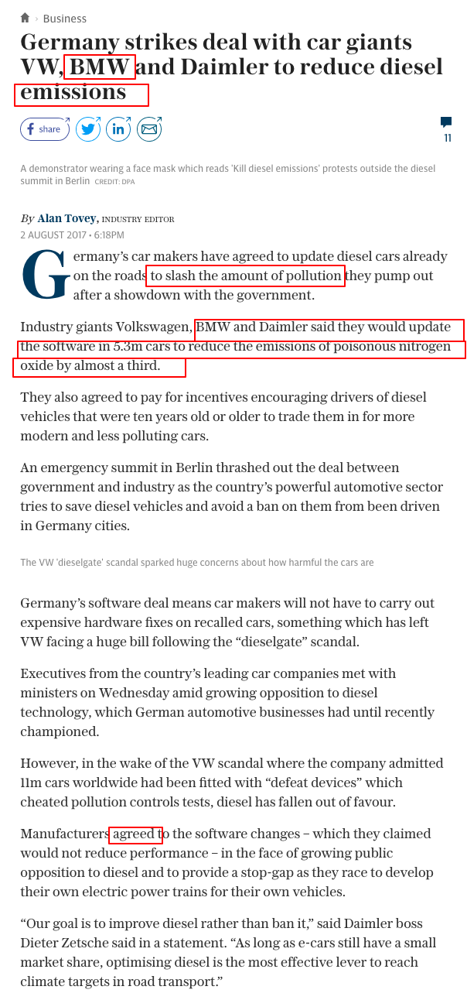

## Coursework Reasoning: Sentiment Analysis of Articles about Climate Change.

### Summary:
Climate change has started to have a profound economic impact. 
Consequently, investors are looking for new methods to assess the risk and opportunities that come with climate change and their investments. 
In this work we seek to understand how to create a short term signal that looks at Sentiment Analysis.
We aim to build an automated service based on Machine Learning(ML) to determine the attitude and emotional reaction of a writer to an entity(company) with respect to Climate Change topic.  
The Sentiment Analysis pipeline includes the following phases:

 

### Authors
This open source project will be implemented by Bohdan Marchenko as a Student Course Work for [**Projector NLP Course**](https://github.com/k-bx/prj-nlp). 
The project is requested and supported by [**CARBON DELTA**](https://www.carbon-delta.com/) GmbH. 

### Technical Details:
The service will be available via Web Interface or/and API. 
The codebase and a sample of training set will be available via [**Github.com**](https://github.com/bmarchenko/prj-nlp)

#### Input Data
1. Text of an article.
2. Name of entity that is an object of a sentiment. This will be a company name e.g. "BMW". 
These will be the biggest public companies, limited by 2,400 securities from [**MSCI ACWI INDEX**](https://www.msci.com/acwi)

#### Output Data
1. An estimate for the sentiment. How "good" or "bad" is the sentiment of the company towards climate change. 
Range is from -2 to +2;
2. Confidence level that this article is about given company, from 0 to 5
3. Confidence level that this is about Climate Change, from 0 to 5

#### Training Set
In order to train ML algorythm a few thousands of articles will be collected and tagged manually by humans. The source of articles may be
  - [**Google search**](https://www.google.com)
 or
  - [**Reuters News Feed**](https://www.reuters.com/tools/rss) for automated scraping.
- [**Microworkers.com**](https://microworkers.com) service is to be used to collect and tag the articles.

#### Examples of a Sentiment evaluation for BMW company: 
 
##### 1. Source: https://www.theclimategroup.org/news/bmw-group-named-among-climate-leaders-automobile-industry-new-cdp-report

###### Result:

 | Estimate   |       Reason     |       Value     | 
|:----------|:-------------|:-------------:|
| **Sentiment** |  The company is "among climate leaders". There are many positive statements about the company in text. | +2 | 
| **Company Confidence level** | The company name is in heading, multiple mentions of "BMW". The text is definitely about the company. |  5 |
| **Climate Change Confidence level** | Multiple mentions of "Climate change", "climate negotiations" and "CDP" | 5 |

##### 2. Source: https://www.businesstimes.com.sg/transport/bmw-admits-diesel-emissions-manipulation-report

###### Result:

| Estimate   |       Reason     |       Value     | 
|:----------|:-------------|:-------------:|
| **Sentiment** |  The company "mislead" and "manipulated" on "emission level". This is a "bad" signal. | -2 | 
| **Company Confidence level** | The company name is in heading, multiple mentions of "BMW" in text.  |  5 |
| **Climate Change Confidence level** | There is no direct mentions of "climate change" but main topic is "emissions standards" and "emissions tests" which are related | 4 |

##### 3. Source: https://www.telegraph.co.uk/business/2017/08/02/germany-strikes-deal-car-giants-vw-bmw-daimler-reduce-diesel/

###### Result:

| Estimate   |       Reason     |       Value     | 
|:----------|:-------------|:-------------:|
| **Sentiment** |  The car makers agreed on reducing emissions in the future. | +1 | 
| **Company Confidence level** | This text is about multiple companies, however including "BMW". Confidence is not very high |  3 |
| **Climate Change Confidence level** | This text is about "pollution" and "emission" which are keywors to climate change topic | 4 |

#### Ideas: 
The service can work on the word frequency of certain key words.

#### Steps:
- Investigate potential data sources
- Create a training set (with all three parameters)
- Create automated methods to asses articles
- Use proper cross validation to test the  [various methods](https://en.wikipedia.org/wiki/Cross-validation_(statistics)), e.g. leave one out “LOOCC”.

 

